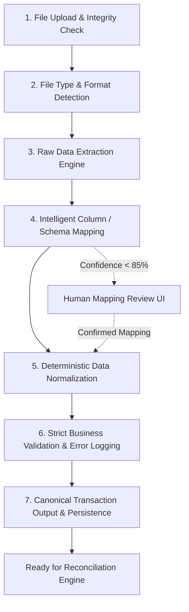

# FinAgent — Data Ingestion & Parse Engine
## Complete Implementation Specification & Architecture (Part 1 of 5)

---

### Executive Overview & Mission
**FinAgent** is an enterprise-grade Automated Bank Statement Reconciliation & Anomaly Investigation Agent.
Part 1 — the **Data Ingestion & Parse Engine** — converts messy, unstructured, multi-bank financial statements (CSV, Excel/XLSX, Text PDF, Scanned PDF via OCR) into clean, deterministic, standardized canonical transaction records ready for Part 2 (Reconciliation & Anomaly Engine).

```
                      +------------------------------------------+
                      |         RAW FINANCIAL STATEMENTS         |
                      |   (HDFC, ICICI, SBI, Axis, Amex, etc.)   |
                      |        CSV / XLSX / PDF / OCR            |
                      +--------------------+---------------------+
                                           |
                                           v
+------------------------------------------------------------------------------------+
|                       PART 1: DATA INGESTION & PARSE ENGINE                        |
|                                                                                    |
|  [Stage 1: Upload] -> [Stage 2: Detect] -> [Stage 3: Extract Raw Data]            |
|                                                                                    |
|  [Stage 4: Column Mapping] -> [Stage 5: Normalization] -> [Stage 6: Validation]    |
|                                                                                    |
|                                          |                                         |
|                                          v                                         |
|                       [Stage 7: Canonical Transaction JSON]                        |
+------------------------------------------+-----------------------------------------+
                                           |
                                           v
+------------------------------------------------------------------------------------+
|                         RECONCILIATION & ANOMALY ENGINE                            |
|                       (Exact, Fuzzy, Tolerance & Composite)                         |
+------------------------------------------------------------------------------------+
```

---

### Core Cardinal Principles

1. **Deterministic Financial Parsing**:
   - Financial arithmetic, date extraction, debit/credit assignment, and validation **MUST NEVER** rely on generative LLM hallucinations.
   - Parsing, cleaning, and mathematical operations must be 100% deterministic (Python, Pandas, regex, OpenPyXL, PyMuPDF, pdfplumber).

2. **Strict Canonical Contract**:
   - Regardless of whether the statement comes from HDFC, Chase, Barclays, SBI, or an internal accounting export, **all rows exit as identical Canonical Transaction JSON objects**.

3. **Zero Data Loss & Auditable Error Queue**:
   - Never drop invalid or malformed rows silently. Every malformed row is cataloged into a `parse_errors` ledger with its line number, raw value, severity (`WARNING` vs `ERROR`), and human-readable explanation.

4. **Preservation of Raw Provenance**:
   - Retain `description_original` alongside `description_normalized` to support Part 3 (AI Investigator Agent) when analyzing fuzzy merchant names or transaction references.

---

## 1. End-to-End Pipeline (7 Internal Stages)



---

## 2. Technical Architecture & Tech Stack

| Layer | Technologies | Purpose |
|---|---|---|
| **Frontend UI** | Next.js 14 / React, TypeScript, Tailwind CSS, Lucide Icons | Drag-and-drop file upload, real-time stage progress, mapping review modal, transaction preview table |
| **API Server** | FastAPI (Python 3.11+ / 3.12+), Uvicorn, Pydantic v2 | High-throughput async REST endpoints, validation schemas, background parsing tasks |
| **Data Extraction** | Pandas, OpenPyXL, PyMuPDF (`fitz`), `pdfplumber`, PaddleOCR / Tesseract | Multi-format tabular data extraction from flat files, spreadsheets, vector PDFs, and scanned receipts |
| **String & Mapping Engine** | RapidFuzz, Levenshtein Distance, Regex Rule Bank | Fuzzy alias matching, heuristic column detection, high-confidence auto-mapping |
| **Database / Storage** | SQLite / PostgreSQL (SQLAlchemy ORM) | Ingestion jobs, file metadata, error logs, and normalized transactions |

---

## 3. Detailed Stage-by-Stage Specifications

### Stage 1: File Upload & Security Verification
- **Accepted Formats**: `.csv`, `.tsv`, `.xlsx`, `.xls`, `.pdf`
- **Max File Size**: 25 MB
- **Security Validations**:
  - Filename sanitization (stripping dangerous traversal paths like `../../`).
  - SHA-256 hash calculation upon receipt to ensure deduplication and audit trail integrity.
  - Virus/malformed binary guard via magic byte inspection.

### Stage 2: File Type Detection
Do **not** trust the file extension blindly. Use magic byte sniffing:
- `%PDF-` -> `PDF` (Distinguish selectable text vs. scanned raster using font/text-layer density check).
- `PK\x03\x04` -> `XLSX` (Zip-compressed XML).
- Plaintext tabular ASCII/UTF-8 -> `CSV` (Sniff delimiter: `,`, `;`, `\t`, `|`).

### Stage 3: Raw Data Extraction
- **CSV/TSV**: Sniff header row offset (many bank statements have 5–10 lines of account metadata before the actual transaction table). Automatically detect the actual table header row using keyword density (`Date`, `Particulars`, `Description`, `Debit`, `Credit`, `Balance`).
- **Excel (.xlsx / .xls)**: Identify the active worksheet with transaction tables; strip bank branch headers.
- **Selectable PDF**: Use `pdfplumber` / PyMuPDF to extract tables preserving cell boundaries and multi-line narrations.
- **Scanned PDF**: Route to OCR pipeline (deskew, binarize, OCR line detection, bounding-box tabular reconstruction).

### Stage 4: Intelligent Schema & Column Mapping
Map heterogeneous bank column headers into canonical fields:
- `date`
- `description`
- `debit` / `credit` (or signed `amount` + `type`)
- `balance` (optional verification anchor)
- `reference` (UTR, Cheque No, Ref ID)
- `currency`

#### Mapping Resolution Order
1. **Exact Dictionary Match**:
   - `["Transaction Date", "Txn Date", "Value Date", "Posting Date", "Date"]` -> `date`
   - `["Particulars", "Narration", "Description", "Transaction Remarks"]` -> `description`
   - `["Debit", "Dr Amount", "Withdrawal", "Debit Amount (INR)"]` -> `debit`
   - `["Credit", "Cr Amount", "Deposit", "Credit Amount (INR)"]` -> `credit`
   - `["Chq/Ref No", "UTR", "Reference Number", "Txn ID", "Cheque No"]` -> `reference`
   - `["Closing Balance", "Balance", "Available Balance"]` -> `balance`
2. **Fuzzy String Similarity**:
   - Token-sort ratio using `RapidFuzz` (Threshold: $\ge 85\%$).
3. **Data Pattern Inference (Heuristics)**:
   - If a column contains $>90\%$ ISO/DMY/MDY date strings -> mapped to `date`.
   - If a column contains floating numbers with currency symbols -> mapped to financial amounts.
4. **Fallback to User Review**:
   - If confidence is $< 85\%$, flag parse job state as `NEEDS_REVIEW` and provide interactive mapping UI.

### Stage 5: Normalization Engine
- **Dates**: Convert any valid format (`DD/MM/YYYY`, `MM/DD/YYYY`, `YYYY-MM-DD`, `DD-Mon-YYYY`, `01 Oct 2026`) into ISO 8601 (`YYYY-MM-DD`).
- **Amounts**: Strip currency symbols (`₹`, `$`, `€`, `£`, `INR`), comma thousands separators (`1,25,000.00` -> `125000.00`), clean trailing `Dr`/`Cr`.
- **Transaction Type**:
  - Two-column format (Debit & Credit columns): If Debit has value -> `DEBIT`, if Credit has value -> `CREDIT`.
  - Single signed amount column: Negative numbers -> `DEBIT`, Positive numbers -> `CREDIT`.
  - Single amount + Indicator column (`DR` / `CR`): Map accordingly.
- **Narrations**:
  - Retain `description_original` verbatim.
  - Strip redundant multiple whitespaces, carriage returns, and control characters for `description_normalized`.

### Stage 6: Validation & Error Handling
Every row undergoes strict Pydantic model validation:
- Valid date format and realistic calendar range (e.g. year between 1990 and 2099).
- `amount > 0` (zero amounts flagged as `WARNING`, negative or NaN amounts flagged as `ERROR`).
- `type` strictly one of `DEBIT` or `CREDIT`.
- Unique deterministic hash generated per transaction:
  $$\text{id} = \text{SHA256}(\text{account} + \text{date} + \text{amount} + \text{type} + \text{reference} + \text{description})[:16]$$
- Error categorization:
  - `WARNING`: Missing reference/UTR number, unusual whitespace.
  - `ERROR`: Invalid date, non-numeric amount, missing description.
  - `FATAL`: Unreadable file structure, encrypted PDF, corrupted archive.

### Stage 7: Canonical Transaction Output
Every transaction produces the exact canonical structure:
```json
{
  "id": "TXN_7F8A1B9C2D3E4F01",
  "date": "2026-10-01",
  "description": "AMAZON SELLER SERVICES MUMBAI",
  "description_original": "UPI-AMAZON SELLER SERVICES-98765@okhdfc-UTR123456",
  "amount": 1250.00,
  "type": "DEBIT",
  "reference": "UTR123456",
  "balance": 84250.00,
  "currency": "INR",
  "source_row": 14
}
```

---

## 4. Canonical Database Schema

```sql
-- Uploaded files metadata
CREATE TABLE files (
    id VARCHAR(36) PRIMARY KEY,
    filename VARCHAR(255) NOT NULL,
    mime_type VARCHAR(100) NOT NULL,
    file_size INTEGER NOT NULL,
    storage_path TEXT NOT NULL,
    sha256_hash VARCHAR(64) NOT NULL,
    status VARCHAR(50) DEFAULT 'UPLOADED',
    created_at TIMESTAMP DEFAULT CURRENT_TIMESTAMP
);

-- Parse execution jobs
CREATE TABLE parse_jobs (
    id VARCHAR(36) PRIMARY KEY,
    file_id VARCHAR(36) REFERENCES files(id),
    status VARCHAR(50) NOT NULL, -- UPLOADED, DETECTING, EXTRACTING, MAPPING, NEEDS_REVIEW, NORMALIZING, VALIDATING, COMPLETED, FAILED
    parser_type VARCHAR(50),      -- CSV, XLSX, PDF_TEXT, PDF_OCR
    total_rows INTEGER DEFAULT 0,
    valid_rows INTEGER DEFAULT 0,
    warning_rows INTEGER DEFAULT 0,
    error_rows INTEGER DEFAULT 0,
    mapping_config JSON,
    started_at TIMESTAMP,
    completed_at TIMESTAMP,
    created_at TIMESTAMP DEFAULT CURRENT_TIMESTAMP
);

-- Canonical normalized transactions
CREATE TABLE transactions (
    id VARCHAR(64) PRIMARY KEY,
    parse_job_id VARCHAR(36) REFERENCES parse_jobs(id),
    date DATE NOT NULL,
    description TEXT NOT NULL,
    description_original TEXT NOT NULL,
    amount NUMERIC(15, 2) NOT NULL,
    type VARCHAR(10) NOT NULL CHECK (type IN ('DEBIT', 'CREDIT')),
    reference VARCHAR(100),
    balance NUMERIC(15, 2),
    currency VARCHAR(10) DEFAULT 'INR',
    source_row INTEGER,
    created_at TIMESTAMP DEFAULT CURRENT_TIMESTAMP
);

-- Parsing error & warning audit log
CREATE TABLE parse_errors (
    id VARCHAR(36) PRIMARY KEY,
    parse_job_id VARCHAR(36) REFERENCES parse_jobs(id),
    row_number INTEGER,
    field VARCHAR(50),
    raw_value TEXT,
    severity VARCHAR(20) NOT NULL CHECK (severity IN ('WARNING', 'ERROR', 'FATAL')),
    message TEXT NOT NULL,
    created_at TIMESTAMP DEFAULT CURRENT_TIMESTAMP
);
```

---

## 5. REST API Endpoints Specification

| Method | Endpoint | Description |
|---|---|---|
| `POST` | `/api/v1/files/upload` | Upload financial file, validate type/size, return `file_id` and initial job |
| `POST` | `/api/v1/parse-jobs/{job_id}/detect` | Run format detection and extract raw sample headers/rows |
| `POST` | `/api/v1/parse-jobs/{job_id}/map-columns` | Auto-detect or manually submit column mappings |
| `POST` | `/api/v1/parse-jobs/{job_id}/execute` | Run normalization, validation, and canonical transaction persistence |
| `GET` | `/api/v1/parse-jobs/{job_id}/status` | Get job lifecycle state and row count statistics |
| `GET` | `/api/v1/parse-jobs/{job_id}/transactions` | Retrieve paginated canonical transactions with filtering |
| `GET` | `/api/v1/parse-jobs/{job_id}/errors` | Retrieve validation errors, warnings, and unparseable rows |
| `GET` | `/api/v1/parse-jobs/{job_id}/export/canonical-json` | Export canonical transaction bundle ready for Part 2 Reconciliation |

---

## 6. Parsing State Machine Lifecycle

```
[UPLOADED]
    │
    ▼
[DETECTING] ──(Unsupported Format)──► [FAILED]
    │
    ▼
[EXTRACTING] ──(Unreadable/Encrypted)──► [FAILED]
    │
    ▼
[MAPPING]
    │
    ├─ (Confidence < 85%) ──► [NEEDS_REVIEW] ──(User Submits Map)──┐
    │                                                               │
    └─ (Confidence >= 85%) ─────────────────────────────────────────┤
                                                                    ▼
                                                            [NORMALIZING]
                                                                    │
                                                                    ▼
                                                            [VALIDATING]
                                                                    │
                                                                    ▼
                                                            [COMPLETED]
```

---

## 7. Definition of Done (DoD) & Acceptance Test Criteria

1. **Multi-Format Ingestion**: Successfully parses clean CSV, messy multi-header CSV, XLSX, text-based bank PDFs (HDFC/ICICI/SBI style), and scanned PDFs.
2. **Accurate Mapping**: Auto-maps standard column aliases with $>95\%$ accuracy; prompts for user intervention when ambiguous.
3. **Robust Normalization**: Standardizes 5+ date formats into `YYYY-MM-DD`, handles Indian (`1,50,000.00`) and Western (`150,000.00`) number formatting, properly splits Debit/Credit.
4. **Audit Trail**: Every invalid row is logged with line number and reason; valid rows persist without dropouts.
5. **Contract Ready for Part 2**: Produces verified Canonical Transaction JSON consumed directly by the Reconciliation Engine.
